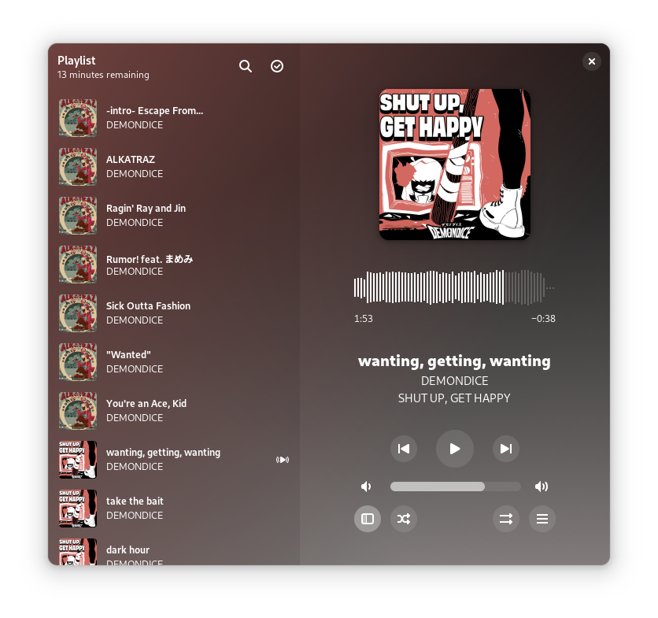

Amberol
=======

A small and simple sound and music player that is well integrated with GNOME.

Amberol aspires to be as small, unintrusive, and simple as possible. It does
not manage your music collection; it does not let you manage playlists, smart
or otherwise; it does not let you edit the metadata for your songs; it does
not show you lyrics for your songs, or the Wikipedia page for your bands.

Amberol plays music, and nothing else.

Flatpak builds
--------------

The recommended way of installing Amberol is through Flatpak. If you don't have
Flatpak installed, you can get it from [the Flatpak website](https://flatpak.org/setup).

You can install stable builds of Amberol from [Flathub](https://flathub.org)
by using this command:

    flatpak remote-add --if-not-exists flathub https://flathub.org/repo/flathub.flatpakrepo
    flatpak install flathub io.bassi.Amberol

Getting in touch
----------------

If you have questions about Amberol, you can join the [`#amberol:gnome.org`](https://matrix.to/#/#amberol:gnome.org)
channel on Matrix, or use the [GNOME Discourse instance](https://discourse.gnome.org/c/applications/7).

Contributing
------------

Please, see the [contribution guide](./CONTRIBUTING.md) if you wish to report
and issue, fix a bug, or implement a new feature.

How to obtain debugging information
-----------------------------------

Run Amberol from your terminal using:

    RUST_BACKTRACE=1 RUST_LOG=amberol=debug flatpak run io.bassi.Amberol

to obtain a full debug log.

Translations
------------

Amberol is translated on the [GNOME translation platform](https://l10n.gnome.org/module/amberol).

You should contact the coordinator of [the localization team for your language](https://l10n.gnome.org/teams/)
if you have questions.

For more information, please see the [GNOME Translation Project wiki](https://wiki.gnome.org/TranslationProject).

Code of conduct
---------------

Amberol follows the GNOME project [Code of Conduct](./code-of-conduct.md). All
communications in project spaces, such as the issue tracker or
[Discourse](https://discourse.gnome.org) are expected to follow it.

Why is it called "Amberol"?
---------------------------

The name comes from the the [Blue Amberol
Records](https://en.wikipedia.org/wiki/Blue_Amberol_Records), a type of cylinder
records made of (blue) nitrocellulose, capable of playback durations of around
four minutes, just about the length of the average song since 1990.

Copyright and licensing
-----------------------

Copyright 2022  Emmanuele Bassi

Amberol is released under the terms of the GNU General Public License, either
version 3.0 or, at your option, any later version.
